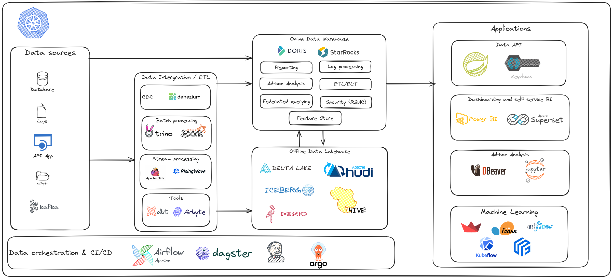

# Data Architecture

# Tools

## &check; 1. Kubernets
### &check; k3s
### &check; k0s
### &check; rke2
### &check; kubeadm

## &check; Minio
## &check; Hive Metastore
## &check; Trino
## &cross; Spark
## &check; Kafka
## &check; Airflow
## &check; Airbyte
## &cross; Flink
## &cross; Risingwave
## &check; Doris
## &cross; StarRocks
## &cross; Superset
## &cross; SpringBoot
## &cross; MLflow
## &cross; Jupyter
## &cross; Jekins
## &cross; Argo CD

