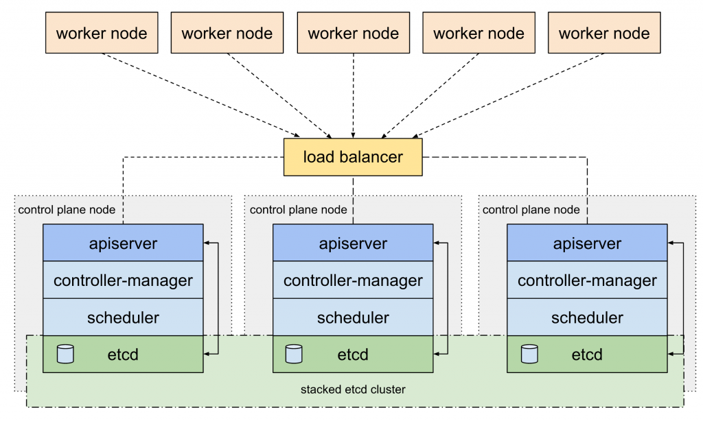

## K3s HA with external lb Architecture


## Prepare
Source: https://docs.expertflow.com/cx/4.3/rke2-deployment-in-high-availability-with-kube-vip#id-(4.3)RKE2DeploymentinHighAvailabilityWithKube-VIP-OpenEBSforLocalStorage

### Install sysbox runtime

```bash
## https://github.com/nestybox/sysbox/blob/master/docs/user-guide/install-package.md#installing-sysbox

wget https://downloads.nestybox.com/sysbox/releases/v0.6.4/sysbox-ce_0.6.4-0.linux_amd64.deb
docker rm $(docker ps -a -q) -f
sudo apt-get install jq
sudo apt-get install ./sysbox-ce_0.6.4-0.linux_amd64.deb
```

### Start docker container like VM

```bash
docker-compose up -d
docker ps -q | xargs -n 1 docker inspect --format '{{range .NetworkSettings.Networks}}{{.IPAddress}}{{end}} {{ .Name }}' | sed 's/ \// /'
#ssh user: admin(root)/admin
# 172.25.1.2 loadbalancer
# 172.25.1.4 master-2
# 172.25.1.5 master-3
# 172.25.1.8 worker-3
# 172.25.1.6 worker-1
# 172.25.1.3 master-1
# 172.25.1.7 worker-2
```

### Add ssh key and change machine-id
```
ssh-keygen
ssh-copy-id root@172.25.1.2
ssh-copy-id root@172.25.1.3
ssh-copy-id root@172.25.1.4
ssh-copy-id root@172.25.1.5
ssh-copy-id root@172.25.1.6
ssh-copy-id root@172.25.1.7
ssh-copy-id root@172.25.1.8 

ssh root@172.25.1.2 'echo $(uuidgen) > /etc/machine-id'
ssh root@172.25.1.3 'echo $(uuidgen) > /etc/machine-id'
ssh root@172.25.1.4 'echo $(uuidgen) > /etc/machine-id'
ssh root@172.25.1.5 'echo $(uuidgen) > /etc/machine-id'
ssh root@172.25.1.6 'echo $(uuidgen) > /etc/machine-id'
ssh root@172.25.1.7 'echo $(uuidgen) > /etc/machine-id'
ssh root@172.25.1.8 'echo $(uuidgen) > /etc/machine-id'
```


## Install and config HAProxy (loadbalancer)
```
ssh root@172.25.1.2
apt-get install -y haproxy
cat >>/etc/haproxy/haproxy.cfg<<EOF

frontend kubernetes-frontend
    bind *:6443
    mode tcp
    option tcplog
    default_backend kubernetes-backend

backend kubernetes-backend
    mode tcp
    option tcp-check
    balance roundrobin
    server master-1 172.25.1.3:6443 check fall 3 rise 2
    server master-2 172.25.1.4:6443 check fall 3 rise 2
    server master-3 172.25.1.5:6443 check fall 3 rise 2

listen stats
   bind *:9999
   mode http
   stats enable
   stats uri /
EOF

systemctl start haproxy.service
systemctl status haproxy.service
```

## Install k3s

### Prepare First Master node (Master 1)

```bash
curl -sfL https://get.k3s.io | K3S_TOKEN=DC87A250BCBA499994CF808CEADD1BCC INSTALL_K3S_VERSION=v1.29.4+k3s1 sh -s - server \
    --cluster-init \
    --disable traefik --disable servicelb \
    --tls-san=172.25.1.2
```

### Remaining Master Nodes (Master 2, 3)

```bash
curl -sfL https://get.k3s.io | K3S_TOKEN=DC87A250BCBA499994CF808CEADD1BCC INSTALL_K3S_VERSION=v1.29.4+k3s1 sh -s - server \
    --server https://172.25.1.3:6443 \
    --disable traefik --disable servicelb \
    --tls-san=172.25.1.2
```

### Deploy Worker Nodes (Worker 1, 2, 3)
```bash
curl -sfL https://get.k3s.io | K3S_TOKEN=DC87A250BCBA499994CF808CEADD1BCC INSTALL_K3S_VERSION=v1.29.4+k3s1 sh -s - agent --server https://172.25.1.2:6443
```

### Copy kubectl config

```bash
scp root@172.25.1.3:/etc/rancher/k3s/k3s.yaml .
sed -i -e 's/127.0.0.1/172.25.1.2/g' ./k3s.yaml

k get no --kubeconfig ./k3s.yaml
```

### install Nginx ingress

```
export KUBECONFIG=./k3s.yaml
helm repo add ingress-nginx https://kubernetes.github.io/ingress-nginx
helm repo update
helm upgrade --install ingress-nginx ingress-nginx/ingress-nginx --set controller.hostNetwork=true,controller.service.type="",controller.kind=DaemonSet --namespace ingress-nginx --version 4.10.1 --create-namespace --debug
```

### Test

```
helm upgrade --install minio -n minio -f ../../charts/minio/minio-values.yaml ../../charts/minio --create-namespace --debug

# add new row to /etc/hosts 
# 172.25.1.3  minio.lakehouse.local
# go to http://minio.lakehouse.local
```

### Install Longhorn (Optional)
By default, K3S uses local-path-propioner as a Storage Class.
We can use other Storage such as Longhorn, Openebs, ...
The environment that is used to lab is the docker container so another store works well. You can lab other Storage on VM environment.

```
helm repo add longhorn https://charts.longhorn.io
helm repo update
helm upgrade --install longhorn longhorn/longhorn --namespace longhorn-system --create-namespace --version 1.6.1 --debug

# persistence.defaultClassReplicaCount: 3
# defaultSettings.defaultDataPath: /var/lib/longhorn/

ssh root@172.25.1.3 'mount --make-rshared /'
ssh root@172.25.1.4 'mount --make-rshared /'
ssh root@172.25.1.5 'mount --make-rshared /'
ssh root@172.25.1.6 'mount --make-rshared /'
ssh root@172.25.1.7 'mount --make-rshared /'
ssh root@172.25.1.8 'mount --make-rshared /'
```